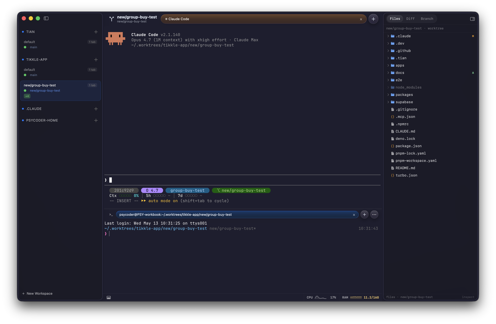

# tian

A native macOS terminal emulator built with SwiftUI, embedding [Ghostty](https://ghostty.org/) as its terminal core.

Ghostty handles the PTY, VT parsing, Metal rendering, font atlas, cursor, selection, scrollback, and color themes. tian wraps it in a native macOS shell with a 4-level workspace model and a CLI for scripting the UI from inside your shell.



## Concepts

tian organizes terminals in five levels:

```
Workspace → Space → Section (Terminal | Claude) → Tab → Pane (split tree)
```

- **Workspace** — top-level unit, one per OS window. Has a name and a default working directory.
- **Space** — a named group of tabs inside a workspace, similar to virtual desktops.
- **Section** — every space has two parallel tab strips: a **Terminal** section and a dedicated **Claude** section. New panes opened in the Claude section auto-launch `claude`, so Claude Code sessions stay separated from regular shells. The two sections have independent tabs and a draggable divider; the Claude section can be docked on the right or at the bottom.
- **Tab** — a single tab inside a section, owning a split tree of panes.
- **Pane** — a single terminal session, mapped 1:1 to a Ghostty surface. Splits horizontally or vertically.

## Interface

- **Sidebar** (`⌘⇧S` / `⌘⇧W` to toggle, `⌘0` to focus) — a left rail listing every workspace and the spaces inside it. Each space row shows its pinned git repos, the latest pane status line, and one colored dot per Claude session in that space:
  - orange — needs attention, Claude is waiting on user input
  - green — active, Claude is responding
  - gray — idle, Claude is waiting between turns
  - animated spinner — busy, long-running tool call
  
  Dots are sorted by priority so a space that needs attention is visible at a glance, even when the workspace is collapsed.

- **Inspect panel** — a right-side panel for the active space with three tabs:
  - **Files** — file tree of the space's working directory with git status badges
  - **Diff** — unified `git diff` against `HEAD`, with per-file additions/deletions
  - **Branch** — local and remote branches with a commit graph
  
  Toggle it with the icon on the trailing edge of the window. When hidden, only a thin rail remains. Git tabs are populated only if the space's working directory is inside a git repo.

- **Claude status monitor** — the colored dots in the sidebar are driven by `tian-cli status set --state <state>`, designed to be called from Claude Code hooks (`PreToolUse` / `PostToolUse` / `Stop`). State updates flow over the IPC socket, so a session signaling `needs_attention` lights up the sidebar even when the workspace isn't focused.

## Install

Download the latest signed and notarized DMG from the [releases page](https://github.com/psycoder-sup/tian/releases/latest), open it, and drag **tian.app** to **Applications**. macOS 26 on Apple Silicon only.

Optional verification:

```sh
shasum -a 256 -c tian-v*.dmg.sha256
spctl -a -t open --context context:primary-signature -v tian-v*.dmg
```

## Build from source

Requirements:

- macOS 26
- Xcode 26.3
- [`zig`](https://ziglang.org/) (`brew install zig`) — required to build Ghostty
- [`xcodegen`](https://github.com/yonaskolb/XcodeGen) (`brew install xcodegen`) — generates the Xcode project

```sh
# 1. Build and vendor GhosttyKit.xcframework (run once, or after updating .ghostty-src)
scripts/build-ghostty.sh

# 2. Generate the Xcode project and build the app
scripts/build.sh Release          # or: scripts/build.sh Debug

# 3. Copy the built app to /Applications
scripts/install.sh
```

`project.pbxproj` is gitignored — on a fresh clone, run `xcodegen generate` (or `scripts/build.sh`) once before opening the project in Xcode. Never edit `project.pbxproj` by hand.

## Default key bindings

| Action | Shortcut |
| --- | --- |
| New tab | `⌘T` |
| Next / previous tab | `⌘⇧]` / `⌘⇧[` |
| Jump to tab _n_ | `⌘1` … `⌘9` |
| New space | `⌘⇧T` |
| Next / previous space | `⌘⇧→` / `⌘⇧←` |
| New workspace (window) | `⌘⇧N` |
| Close workspace | `⌘⇧⌫` |
| Toggle sidebar | `⌘⇧S` or `⌘⇧W` |
| Focus sidebar | `⌘0` |
| Toggle terminal section | `⌃` `` ` `` |
| Cycle section focus | `⌘⇧` `` ` `` |
| Toggle debug overlay | `⌘⇧P` |

## `tian-cli`

Each pane runs with `TIAN_SOCKET`, `TIAN_PANE_ID`, `TIAN_TAB_ID`, `TIAN_SPACE_ID`, and `TIAN_WORKSPACE_ID` set, letting the bundled `tian-cli` binary talk to the running app over a Unix socket.

```sh
tian-cli ping                  # check the connection
tian-cli workspace …           # workspace commands
tian-cli space …               # space commands
tian-cli tab …                 # tab commands
tian-cli pane …                # pane commands
tian-cli status …              # surface status
tian-cli worktree …            # git worktree helpers
tian-cli git …                 # git helpers
tian-cli notify …              # send a notification
tian-cli config …              # read/write config
```

The CLI only works from inside a tian terminal session — it errors out cleanly if `TIAN_SOCKET` is not set. Run `tian-cli <command> --help` for subcommand details.

## Logs

File-logged categories (`ipc`, `lifecycle`, `persistence`, `git`) write to `~/Library/Logs/tian/tian.log` (rotated to `tian.1.log`). Other categories (`core`, `view`, `ghostty`, `perf`, `worktree`) go to unified logging:

```sh
log stream --predicate 'subsystem == "com.tian.app"'
```

## Project layout

- `tian/` — app source (Workspace, Tab, Pane, Core, View, Input, Persistence, …)
- `tian-cli/` — `tian` CLI source (Swift, ArgumentParser)
- `tianTests/` — unit tests
- `scripts/` — build, ghostty, install
- `docs/` — feature specs and design docs
- `tian/Vendor/` — `GhosttyKit.xcframework` + `ghostty.h` (built via `scripts/build-ghostty.sh`)
- `.dev/tmp/` — gitignored scratch space for experiments

See [`CLAUDE.md`](CLAUDE.md) for deeper architecture notes.
